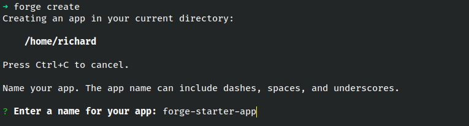
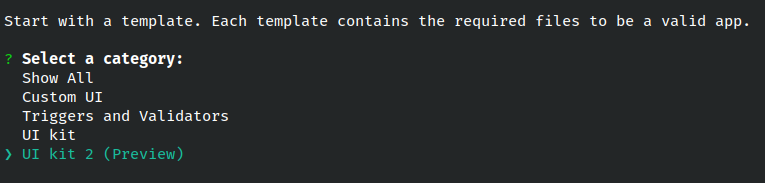
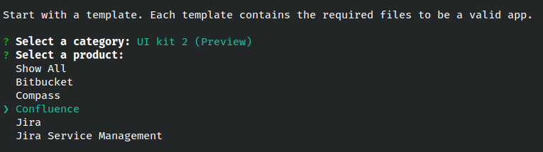
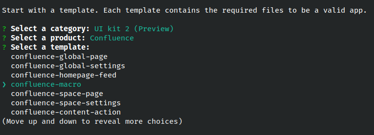
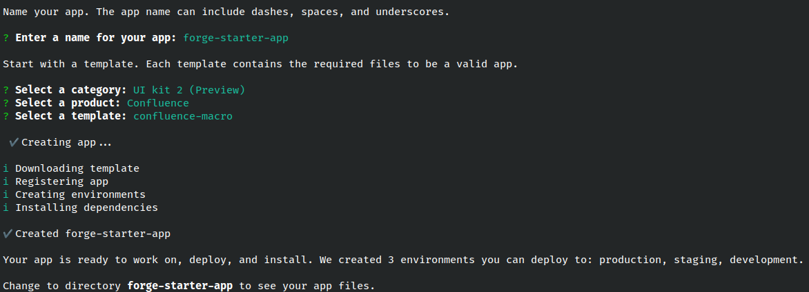
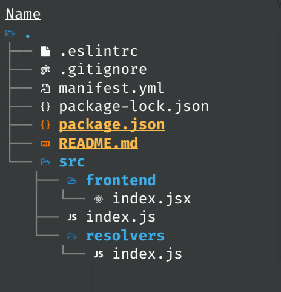

# Exercise 1 - Building your first app

Welcome to the course. We will be building a Forge app that extends the native functionality of Confluence by creating custom extensions that users can see and interact with.

1. Navigate to the directory where you want create the app.

2. Open up a terminal and initialize the app by running the following command:

```shell
forge create
```

3. Enter a name for your app e.g. _forge-starter-app_



4. There are variety of pre-built templates for us to choose from. Select _UI kit 2 (Preview)_ from the list.



5. For this course, we'll be developing a Confluence app so choose _Confluence_ from the list of products.



6. Lastly, select the _confluence-macro_ template.



7. After a few seconds, a new directory with the name of the app will be created.



8. Change to the *forge-starter-app* directory to see the app files.

```shell
cd forge-starter-app
```

## Files and folder structure



The `forge create` command initializes a basic hello world app from the project template you selected and generates the following files in your project directory:

- `manifest.yml`: Describes your app. This file contains the name and ID of the app, the app permissions, and the modules the app uses.

- `package.json`: The app’s Node.js metadata.

- `package-lock.json`: A record of the app’s dependencies and their specific versions.

- `README.md`: Information about the app including instructions on how to deploy and install your app.

- `src/frontend/index.jsx`: Frontend code for the client-facing user interface.

- `src/resolvers/index.js`: Backend code ([resolver functions](https://developer.atlassian.com/platform/forge/runtime-reference/custom-ui-resolver/)) for your app.

## The manifest

The `manifest.yml` that’s generated will have the following format:

```yaml
modules:
  macro:
    - key: forge-starter-app-hello-world-macro
      resource: main
      render: native
      resolver:
        function: resolver
      title: forge-starter-app
  function:
    - key: resolver
      handler: index.handler
resources:
  - key: main
    path: src/frontend/index.jsx
app:
  id: ari:cloud:ecosystem::app/xxxxxxxx-xxxx-xxxx-xxxx-xxxxxxxxxxxx
```

Lets break down each line of the manifest:

- modules - a list of all the [modules](https://developer.atlassian.com/platform/forge/manifest-reference/modules/) used by the app
  - macro - indicates that the app includes a [macro](https://developer.atlassian.com/platform/forge/manifest-reference/modules/macro/) module
    - resource - a unique key for the static resource which is cross-referenced under resources in line 13
    - render - Only used if it’s a UI Kit 2 module and the value will always be native
    - resolver - sets the backend resolver function that this specific module can call
      - function - a unique key for the function which is cross-referenced under function in line 10
    - title - the title of the macro which is displayed in the Confluence editor
  - function - specifies a list of functions that are called by the app’s modules
    - key - unique key for the specific function that is being defined
    - handler - a pointer to the function responsible for handling invocations. Takes the format **file.function**
- resources - specifies a list of static assets for the app
  - key - unique key for the specific resource
  - path - location of the static resource
- app - specifies information about the app and its properties such as licensing
  - id - automatically generated when running forge create. Represents an **Atlassian resource identifier (ari)** unique to your app.
