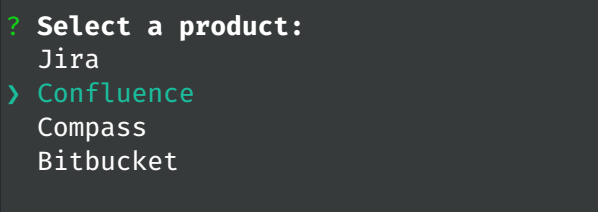
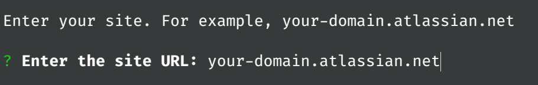
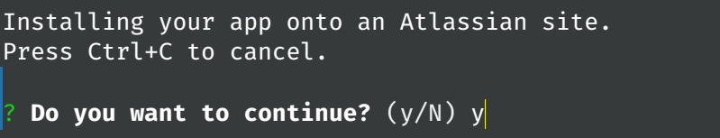
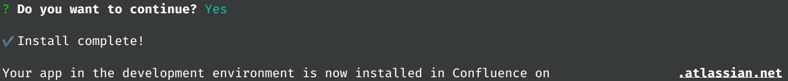
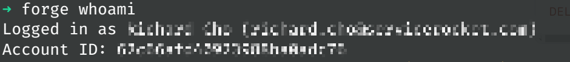

# Exercise 2 - Deploying and installing your app

**Note**: You must run the forge deploy command before forge install because an installation links your deployed app to an Atlassian site.

To use your app, it must be installed onto an Atlassian site. The forge deploy command builds, compiles, and deploys your code; it'll also report any compilation errors. The forge install command then installs the deployed app onto an Atlassian site.

1. Navigate to the app's top-level directory and deploy your app by running:

```shell
forge deploy
```

2. Install your app by running:

```shell
forge install
```

3. Select your Atlassian product (**Confluence** in this case) using the arrow keys and press Enter.



4. Enter your Atlassian site when prompted



5. Press `y` to confirm your selection.



6. If the installation is successful, then you will see the following message.



7. If the installation fails due to invalid credentials, double-check that you are logged in correctly using the `forge whoami` command.


