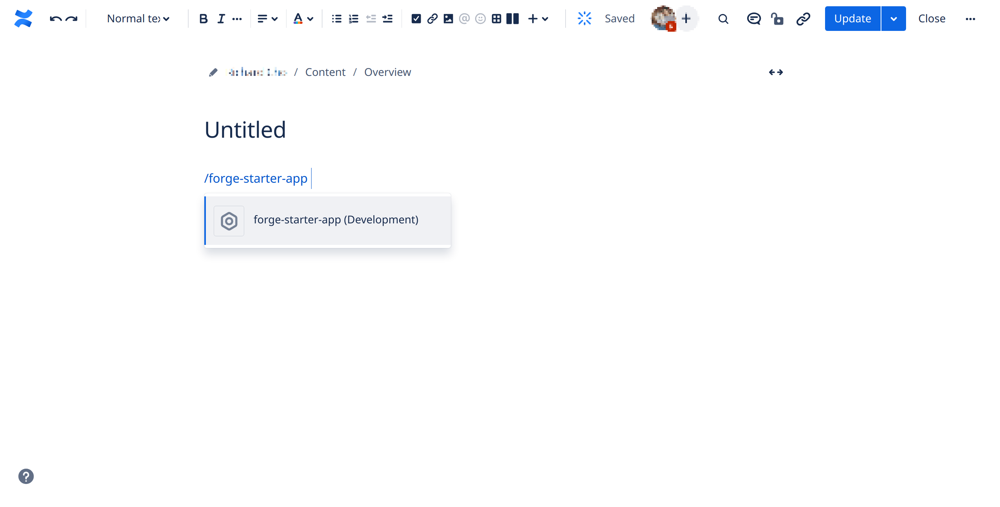

# Exercise 3 - Interacting with the app

1. Open up a browser and navigate to your Confluence instance

2. Create a page or edit an existing one

3. Once you’re in the editor, you can insert the macro by selecting ➕ from the toolbar or by typing backspace plus the macro title which is defined in the manifest e.g. `/forge-starter-app`



4. Save the page to see the results of the macro. The macro displays two lines of text. The first line is static and will always show `Hello, World!`.

   The second line is generated programmatically and can either show `Loading...` or `Hello, World!`.


5. Let’s take a look at the app logic in the following two files:

   `src/frontend/index.jsx`

   ```js
   import ForgeReconciler, { Text } from "@forge/react";
   import React, { useEffect, useState } from "react";

   import { invoke } from "@forge/bridge";

   const App = () => {
     const [data, setData] = useState(null);

     useEffect(() => {
       invoke("getText", { example: "my-invoke-variable" }).then(setData);
     }, []);

     return (
       <>
         <Text>Hello, World!</Text>
         <Text>{data ? data : "Loading..."}</Text>
       </>
     );
   };
   ```

   This file is the frontend portion of the macro and controls what the end users see.

   In line 4, we import a function called invoke from the `@forge/bridge` package.

   `@forge/bridge` includes a number of functions that enable apps to securely integrate with Atlassian products.

   In this example, we’re calling invoke which allows the app to run our backend functions.

   In line 10, the specific function we’re invoking is the `getText` function which is located in the backend hand. This example also details how you would pass a payload object from the frontend to the backend (more details below).

   `src/resolvers/index.js`

   ```js
   import Resolver from "@forge/resolver";

   const resolver = new Resolver();

   resolver.define("getText", (req) => {
     console.log(req);
     return "Hello, World!";
   });

   export const handler = resolver.getDefinitions();
   ```

   This file contains all the backend resolver functions that the app can invoke from the frontend.We’ve only defined a single function called getText that only does two things. It first logs the request context (req) and it also returns a response with a value of Hello, World! to the frontend.

   If we were to examine the req object that gets logged out in line 6, it would look something like:

   ```json
   {
     "payload": {
       "example": "my-invoke-variable"
     },
     "context": {
       "localId": "xxxxxxxx-xxxx-xxxx-xxxx-xxxxxxxxxxxx",
       "cloudId": "xxxxxxxx-xxxx-xxxx-xxxx-xxxxxxxxxxxx",
       "moduleKey": "forge-starter-app-hello-world-macro",
       "siteUrl": "https://your-site.atlassian.net",
       "extension": {
         "type": "macro",
         "content": {
           "id": "123456"
         },
         "space": {
           "key": "SPACE_KEY",
           "id": "ABC123"
         },
         "isEditing": false,
         "references": []
       },
       "installContext": "ari:cloud:confluence::site/xxxxxxxx-xxxx-xxxx-xxxx-xxxxxxxxxxxx",
       "accountId": "xxxxxxxxxxxxxxxxxxxxxxxx"
     }
   }
   ```

   Inside the payload property, we have access to the payload that was sent from the frontend.Additionally, the context property has various pieces of information attached that may be useful depending on your need and use case.

   **Note:** the context values will differ depending on the [module](https://developer.atlassian.com/platform/forge/manifest-reference/modules/).
