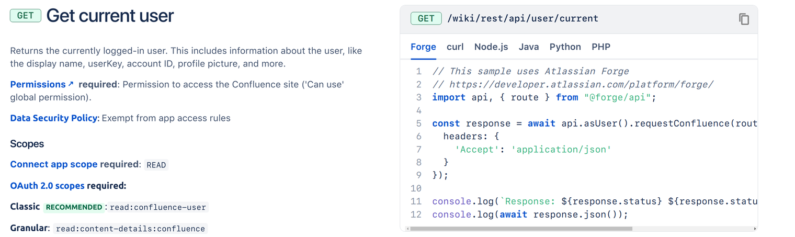

# Exercise 4 - Calling the Confluence REST API

Instead of the app returning Hello, World twice, let’s make it greet the current user e.g. Hello, John.

To do so, we will use the Confluence REST API’s get current user endpoint.

If we look at the API docs for that particular endpoint, it gives us some useful information about the scopes we need to add to our app, a schema of the expected response and also a useful example of how we can call this endpoint.



1. Update the scope of our app by including read:confluence-user in our manifest (reference) under a new section called permissions:

   ```yaml
   modules:
     macro:
       - key: forge-starter-app-hello-world-macro
         resource: main
         render: native
         resolver:
           function: resolver
         title: forge-starter-app
     function:
       - key: resolver
         handler: index.handler
   resources:
     - key: main
       path: src/frontend/index.jsx
   app:
     id: ari:cloud:ecosystem::app/xxxxxxxx-xxxx-xxxx-xxxx-xxxxxxxxxxxx
   permissions:
     scopes:
       - read:confluence-user
   ```

2. Whenever you change permissions, you must deploy a new version of the app and upgrade your current installation to see the new changes.

   Stop your tunnel and run the following commands in your terminal to deploy and upgrade your installation.

   Follow the relevant prompts to complete the upgrade before restarting the tunnel.

   ```shell
   forge deploy
   forge install --upgrade
   forge tunnel
   ```

3. Next, we will add a new resolver function to our backend called `getCurrentUser`.

   This is located in the same file as the getText function. We will base our code off the example provided to us by the docs with a few changes to ensure we’re returning the API response to the frontend.

   First, we will be using the Product Fetch API from the @forge/api package to make an authenticated API call to the Confluence REST API. The @forge/api package contains other Forge APIs that can used within your app.

   Import the package and relevant functions.

   ```jsx
   import api, { route } from "@forge/api";
   ```

4. Add a new resolver function to your file that fetches the current user.

   ```jsx
   resolver.define("getCurrentUser", async () => {
     const response = await api
       .asUser()
       .requestConfluence(route`/wiki/rest/api/user/current`, {
         headers: {
           Accept: "application/json",
         },
       });
     const currentUser = await response.json();
     return currentUser;
   });
   ```

   The `src/resolvers/index.js` file should now look like:

   ```jsx
   import api, { route } from "@forge/api";

   import Resolver from "@forge/resolver";

   const resolver = new Resolver();

   resolver.define("getText", (req) => {
     console.log(req);
     return "Hello, World!";
   });

   resolver.define("getCurrentUser", async () => {
     const response = await api
       .asUser()
       .requestConfluence(route`/wiki/rest/api/user/current`, {
         headers: {
           Accept: "application/json",
         },
       });
     const currentUser = await response.json();
     return currentUser;
   });

   export const handler = resolver.getDefinitions();
   ```

5. Modify the frontend code to invoke the newly added getCurrentUser function.

   ```jsx
   import ForgeReconciler, { Text } from "@forge/react";
   import React, { useEffect, useState } from "react";

   import { invoke } from "@forge/bridge";

   const App = () => {
     const [user, setUser] = useState(null);

     useEffect(() => {
       invoke("getCurrentUser").then(setUser);
     }, []);

     return (
       <>
         {user ? (
           <Text>{`Hello, ${user.publicName}!`}</Text>
         ) : (
           <Text>{"Loading..."}</Text>
         )}
       </>
     );
   };

   ForgeReconciler.render(
     <React.StrictMode>
       <App />
     </React.StrictMode>
   );
   ```

   The app should now greet the current user when the macro is added to a page.

   
