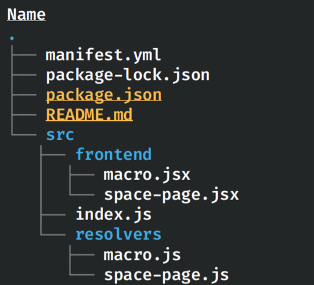

# Exercise 6 - Adding additional modules

Modules are used to extend the functionality of our app. For this example, we’re going to add a Confluence space page module.

To add a new module, we first need to update the `modules` and `resources` sections inside `manifest.yml`.

Generally, when adding a new module the steps include:

1. Add the relevant module under the `modules` section which in our case is `confluence:spacePage`

   ```yaml
   modules:
     confluence:spacePage:
   ```

2. Include all the required properties for that module (check the docs when unsure)

   ```yaml
   modules:
     confluence:spacePage:
       - key: forge-starter-app-space-page
         resource: spacePage
         render: native
         resolver:
           function: space-page-resolver
         route: forge-starter-app-space-page
         title: forge-starter-app
   ```

3. Add a resolver function (if you need to invoke a backend function)

   ```yaml
   function:
     - key: space-page-resolver
       handler: index.spacePageHandler
   ```

4. Update the `resources` section to include the static assets for that module

```yaml
resources:
  - key: spacePage
    path: src/frontend/space-page.jsx
```

We also took this opportunity to change some of the values for the `macro` module to be more descriptive and unique so that it doesn’t clash with any future modules that we may add.

The updated `manifest.yml` should look like:

```yaml
modules:
  macro:
    - key: forge-starter-app-hello-world-macro
      resource: main
      render: native
      resolver:
        function: resolver
      title: forge-starter-app
  confluence:spacePage:
    - key: forge-starter-app-space-page
      resource: space-page
      render: native
      resolver:
        function: space-page-resolver
      route: forge-starter-app-space-page
      title: forge-starter-app
  function:
    - key: resolver
      handler: index.handler
    - key: space-page-resolver
      handler: index.spacePageHandler
resources:
  - key: main
    path: src/frontend/index.jsx
  - key: space-page
    path: src/frontend/space-page.jsx
app:
  id: ari:cloud:ecosystem::app/xxxxxxxx-xxxx-xxxx-xxxx-xxxxxxxxxxxx
  runtime:
    name: nodejs18.x
permissions:
  scopes:
    - read:confluence-user
```

In addition to updating the manifest, we also need to create some new files and update some existing ones.

First, let’s update the `resolvers` directory to have two resolver files in order to separate the logic: one for the macro and another for the space page.

1. Rename `src/resolvers/index.js` to `src/resolvers/macro.js` and change the export from `handler` to `macroHandler`. We can also remove the `getText` function since we no longer need it.

   ```jsx
   import api, { route } from "@forge/api";

   import Resolver from "@forge/resolver";

   const resolver = new Resolver();

   resolver.define("getCurrentUser", async () => {
     const response = await api
       .asUser()
       .requestConfluence(route`/wiki/rest/api/user/current`, {
         headers: {
           Accept: "application/json",
         },
       });
     return await response.json();
   });

   export const macroHandler = resolver.getDefinitions();
   ```

2. Create a new file inside the `resolvers` directory called `space-page.js`. For the time being, let’s include the same `getCurrentUser` function that we used previously for the macro and export it as `spacePageHandler`.

   ```jsx
   import api, { route } from "@forge/api";

   import Resolver from "@forge/resolver";

   const resolver = new Resolver();

   resolver.define("getCurrentUser", async () => {
     const response = await api
       .asUser()
       .requestConfluence(route`/wiki/rest/api/user/current`, {
         headers: {
           Accept: "application/json",
         },
       });
     return await response.json();
   });

   export const spacePageHandler = resolver.getDefinitions();
   ```

3. Since we now have multiple modules with each module having their own resolver, we need to update `src/index.js` to export both `macroHandler` and `spacePageHandler`.

   **Note:** This is important because, as mentioned previously, Forge requires that we point to our backend functions using the `file.function` format e.g. `index.macroHandler` and `index.spacePageHandler`.

   `src/index.js` should now look like:

   ```jsx
   export { macroHandler } from "./resolvers/macro";
   export { spacePageHandler } from "./resolvers/space-page";
   ```

4. After separating the resolvers into two separate files, let’s do the same for our frontend. Rename `src/frontend/index.jsx` to `src/frontend/macro.jsx` and create a new file in the frontend directory called `space-page.jsx` with the following content:

   ```jsx
   import ForgeReconciler, { Text } from "@forge/react";
   import React, { useEffect, useState } from "react";

   import { User } from "@forge/react";
   import { invoke } from "@forge/bridge";

   const App = () => {
     const [user, setUser] = useState(null);

     useEffect(() => {
       invoke("getCurrentUser").then(setUser);
     }, []);

     return (
       <>
         {user ? (
           <User accountId={user.accountId} />
         ) : (
           <Text>{"Loading..."}</Text>
         )}
       </>
     );
   };

   ForgeReconciler.render(
     <React.StrictMode>
       <App />
     </React.StrictMode>
   );
   ```

   Your app directory should look like the following:

   

5. The last step is to close our tunnel, deploy the changes and restart the tunnel.

   We do not need to upgrade our existing installation with `forge install --upgrade` since it’s not considered a major version change and the latest changes will be applied to our existing installation.

   ```shell
   forge deploy
   forge tunnel
   ```

   We can look at the new space page module by accessing it from the space navigation menu underneath the `Apps` heading.

   

   Since the code is exactly the same as the macro, the profile picture and name of the current user will be displayed.

   
