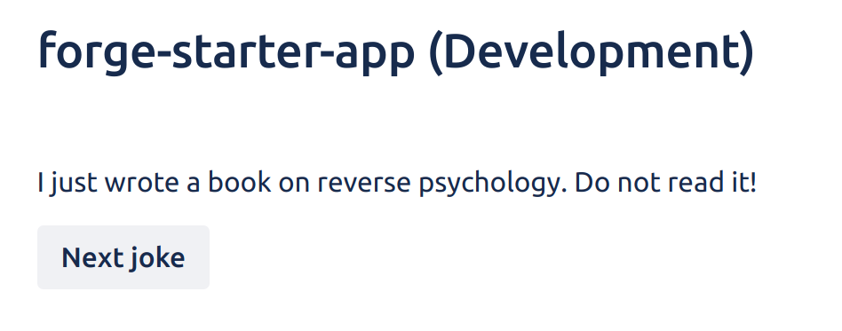

# Exercise 7 - Calling an external API

Instead of fetching data from the Confluence REST API to display the current user, let’s modify the space page to fetch data from an external API instead.

The API we’ll be using for this example is https://icanhazdadjoke.com which returns a random joke.

To start, we have to once again modify our `manifest.yml` to specify that our app will be calling an external URL outside of Atlassian.

1. Update `permissions` to include the external URL:

   ```yaml
   permissions:
     scopes:
       - read:confluence-user
     external:
       fetch:
         backend:
           - https://icanhazdadjoke.com
   ```

2. Since we’ve updated the permissions of the app, we need to once again deploy, upgrade and restart.

   ```shell
   forge deploy
   forge install --upgrade
   forge tunnel
   ```

3. Update `src/spacePage.js` and replace getUser with a new function called `getJoke`.

   To fetch from an external endpoint, we have to use the fetch API from the `@forge/api` package instead of the native implementation. [More info](https://developer.atlassian.com/platform/forge/runtime-reference/fetch-api/).

   ```jsx
   import Resolver from "@forge/resolver";
   import { fetch } from "@forge/api";

   const resolver = new Resolver();

   resolver.define("getJoke", async () => {
     const response = await fetch("https://icanhazdadjoke.com", {
       headers: {
         Accept: "application/json",
       },
     });
     return await response.json();
   });

   export const spacePageHandler = resolver.getDefinitions();
   ```

4. Update `src/frontend/space-page.jsx` to call `getJoke` and also add a button to the UI so that user’s can cycle through multiple jokes.

   ```jsx
   import ForgeReconciler, { Button, Text } from "@forge/react";
   import React, { useEffect, useState } from "react";

   import { invoke } from "@forge/bridge";

   const App = () => {
     const [joke, setJoke] = useState(null);

     const fetchJoke = async () => {
       const data = await invoke("getJoke");
       setJoke(data.joke);
     };

     useEffect(() => {
       fetchJoke();
     }, []);

     return (
       <>
         <Text>{joke ? joke : "Loading..."}</Text>
         <Button onClick={fetchJoke}>Next joke</Button>
       </>
     );
   };

   ForgeReconciler.render(
     <React.StrictMode>
       <App />
     </React.StrictMode>
   );
   ```

   End result:

   
